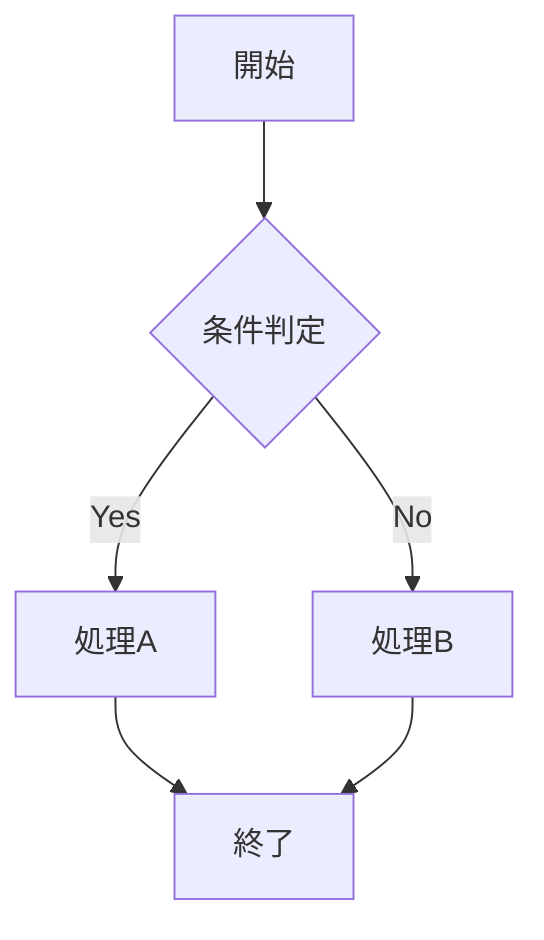
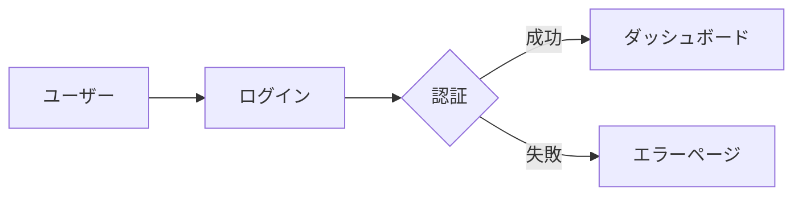

**コンポーネントの使用方法**

Mizukiテーマには、記事作成を効率化する多くの組み込みコンポーネントが含まれています。

## 基本コンポーネント

### アラートボックス

```markdown
::: tip ヒント
これは役立つヒントです。
:::

::: warning 警告
これは注意が必要な内容です。
:::

::: danger 危険
これは危険な操作に関する警告です。
:::

::: info 情報
これは一般的な情報です。
:::
```

### 折りたたみ

```markdown
::: details クリックして詳細を表示
ここに詳細な内容を書きます。
長いコードや説明を折りたたんで表示できます。
:::
```

### タブ

```markdown
::: tabs
@tab JavaScript
```javascript
console.log('Hello, World!');
```

@tab TypeScript
```typescript
const message: string = 'Hello, World!';
console.log(message);
```

@tab Python
```python
print('Hello, World!')
```
:::
```

## 高度なコンポーネント

### コードグループ

```markdown
::: code-group
```bash [npm]
npm install astro
```

```bash [yarn]
yarn add astro
```

```bash [pnpm]
pnpm add astro
```
:::
```

### カード

```markdown
::: card タイトル
カードの内容をここに書きます。
重要な情報やハイライトしたい内容に使用します。
:::
```

### リンクカード

```markdown
::: link-card
title: Astro公式サイト
desc: 高速で現代的なウェブサイトを構築
link: https://astro.build
:::
```

## メディアコンポーネント

### 画像ギャラリー

```markdown
::: gallery


:::
```

### YouTube埋め込み

```markdown
::: youtube VIDEO_ID
YouTube動画のタイトル
:::
```

### CodePen埋め込み

```markdown
::: codepen USER_NAME/PEN_ID
CodePenのタイトル
:::
```

## インタラクティブコンポーネント

### アコーディオン

```markdown
::: accordion
@item 質問1
回答1の内容をここに書きます。

@item 質問2
回答2の内容をここに書きます。
:::
```

### ステップ

```markdown
::: steps
1. 最初のステップ
   詳細な説明をここに書きます。

2. 2番目のステップ
   次に行うべき作業について説明します。

3. 最後のステップ
   完了までの最終手順です。
:::
```

## 特殊コンポーネント

### 数式

```markdown
インライン数式: $E = mc^2$

ブロック数式:
$$
\int_{-\infty}^{\infty} e^{-x^2} dx = \sqrt{\pi}
$$
```

### Mermaid図表

```markdown

```

### フローチャート

```markdown

```

## カスタムコンポーネント

### 作者情報

```markdown
::: author
name: 作者名
avatar: /images/avatar.jpg
bio: ウェブ開発者として10年の経験があります。
social:
  - twitter: @username
  - github: username
:::
```

### 目次

```markdown
::: toc
:::
```

### 関連記事

```markdown
::: related
- [記事タイトル1](/blog/post1/)
- [記事タイトル2](/blog/post2/)
- [記事タイトル3](/blog/post3/)
:::
```

## スタイリング

### カスタムCSS

```markdown
::: custom-style
<style>
.highlight {
  background: linear-gradient(120deg, #a8edea 0%, #fed6e3 100%);
  padding: 0.2em 0.4em;
  border-radius: 3px;
}
</style>

<span class="highlight">ハイライトされたテキスト</span>
:::
```

### カラーパレット

```markdown
::: color-palette
- primary: #3b82f6
- secondary: #64748b
- success: #10b981
- warning: #f59e0b
- danger: #ef4444
:::
```

## 使用上の注意

### パフォーマンス

1. **画像の最適化** - 大きな画像は事前に圧縮してください
2. **コンポーネントの適切な使用** - 必要以上に複雑にしないでください
3. **読み込み速度** - 重いコンポーネントは必要な場合のみ使用してください

### アクセシビリティ

1. **alt属性** - 画像には適切なalt属性を設定してください
2. **見出し構造** - 適切な見出しレベルを使用してください
3. **色のコントラスト** - 十分なコントラストを確保してください

### SEO

1. **構造化データ** - 適切なマークアップを使用してください
2. **メタデータ** - 記事のメタデータを適切に設定してください
3. **内部リンク** - 関連記事への適切なリンクを設置してください

## カスタムコンポーネントの作成

独自のコンポーネントを作成することも可能です：

```astro
---
// src/components/CustomComponent.astro
export interface Props {
  title: string;
  description?: string;
}

const { title, description } = Astro.props;
---

<div class="custom-component">
  <h3>{title}</h3>
  {description && <p>{description}</p>}
  <slot />
</div>

<style>
.custom-component {
  border: 2px solid #e5e7eb;
  border-radius: 8px;
  padding: 1rem;
  margin: 1rem 0;
}
</style>
```

使用方法：
```astro
<CustomComponent title="カスタムタイトル" description="説明文">
  ここにコンテンツを書きます。
</CustomComponent>
```