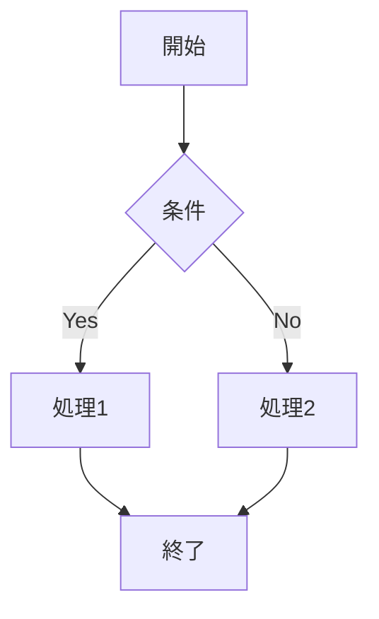

**Markdown記法ガイド**

Mizukiテーマは標準的なMarkdown記法をサポートし、さらに多くの拡張機能を提供します。

## 基本記法

### 見出し

```markdown
# H1見出し
## H2見出し
### H3見出し
#### H4見出し
##### H5見出し
###### H6見出し
```

### テキスト装飾

```markdown
**太字**
*斜体*
~~取り消し線~~
`インラインコード`
```

### リスト

```markdown
- 順序なしリスト項目1
- 順序なしリスト項目2
  - ネストした項目

1. 順序ありリスト項目1
2. 順序ありリスト項目2
   1. ネストした項目
```

### リンクと画像

```markdown
[リンクテキスト](https://example.com)

```

## 拡張記法

### コードブロック

````markdown
```javascript
function hello() {
  console.log("Hello, World!");
}
```
````

### 表

```markdown
| 列1 | 列2 | 列3 |
|-----|-----|-----|
| データ1 | データ2 | データ3 |
| データ4 | データ5 | データ6 |
```

### 引用

```markdown
> これは引用文です。
> 複数行にわたって書くことができます。
```

### 注意ボックス

```markdown
::: tip ヒント
これは役立つヒントです。
:::

::: warning 警告
これは注意が必要な内容です。
:::

::: danger 危険
これは危険な操作に関する警告です。
:::
```

### 折りたたみ

```markdown
::: details クリックして詳細を表示
ここに詳細な内容を書きます。
:::
```

## 特別な機能

### 数式

```markdown
インライン数式: $E = mc^2$

ブロック数式:
$$
\int_{-\infty}^{\infty} e^{-x^2} dx = \sqrt{\pi}
$$
```

### 図表

```markdown

```

### タブ

```markdown
::: tabs
@tab タブ1
タブ1の内容

@tab タブ2
タブ2の内容
:::
```

## 記事のメタデータ

各記事の先頭にFrontmatterを追加できます：

```yaml
---
title: 記事タイトル
date: 2025-01-15
tags: 
  - タグ1
  - タグ2
categories:
  - カテゴリ1
description: 記事の説明
---
```

## 書き方のコツ

1. **見出しの階層を適切に使用** - SEOと読みやすさのために
2. **画像にalt属性を追加** - アクセシビリティのために
3. **コードブロックに言語を指定** - シンタックスハイライトのために
4. **適切な改行と空白** - 読みやすさのために