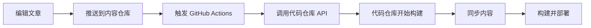

## 问题说明

当使用 [内容代码分离](/guide/content-separation/) 功能时，会遇到一个问题：

- ✅ **代码仓库**更新会自动触发部署
- ❌ **内容仓库**更新**不会**自动触发部署

这意味着你在内容仓库发布新文章后，需要手动触发代码仓库的重新部署才能看到更新。

## 解决方案

配置自动触发机制，让内容仓库更新时也能自动重新部署站点。

推荐使用 **Repository Dispatch**，适用于所有部署平台。

## Repository Dispatch 配置

### 原理

通过 GitHub Actions，在内容仓库推送时自动触发代码仓库的部署工作流。

### 优势

✅ **实时触发** - 内容更新后立即部署  
✅ **通用方案** - 适用所有平台（GitHub Pages/Vercel/Netlify/Cloudflare Pages）  
✅ **配置简单** - 一次配置，长期有效  
✅ **完全免费** - 使用 GitHub 原生功能

## 5 步快速配置

### Step 1: 创建 GitHub Token

访问 [GitHub Settings → Tokens](https://github.com/settings/tokens)

1. 点击 **Generate new token (classic)**
2. 填写 Token 名称: `Mizuki Content Trigger`
3. 勾选权限: ✅ `repo` (完整仓库访问)
4. 点击生成并**立即复制** Token ⚠️（只显示一次）

### Step 2: 添加 Secret

在**内容仓库** (Mizuki-Content) 中:

1. Settings → Secrets and variables → Actions
2. 点击 **New repository secret**
3. 添加:
   - Name: `DISPATCH_TOKEN`
   - Secret: 粘贴刚才的 Token

### Step 3: 创建触发工作流

在内容仓库创建文件 `.github/workflows/trigger-build.yml`:

```yaml
name: Trigger Main Repo Build

on:
  push:
    branches:
      - main  # 或你使用的主分支
    paths:
      - 'posts/**'
      - 'spec/**'
      - 'data/**'
      - 'images/**'
  workflow_dispatch:

jobs:
  trigger:
    runs-on: ubuntu-latest
    steps:
      - name: Trigger repository dispatch
        uses: peter-evans/repository-dispatch@v2
        with:
          token: ${{ secrets.DISPATCH_TOKEN }}
          repository: your-username/Mizuki  # ⚠️ 改为你的代码仓库
          event-type: content-updated
```

:::warning 重要
将 `repository: your-username/Mizuki` 改为你的实际代码仓库地址，格式为 `owner/repo`
:::

### Step 4: 更新代码仓库工作流

编辑**代码仓库**的 `.github/workflows/deploy.yml`:

```yaml
name: Deploy

on:
  push:
    branches:
      - main
  repository_dispatch:  # 👈 添加这个部分
    types:
      - content-updated
  workflow_dispatch:

# ...其余配置保持不变
```

### Step 5: 测试

在内容仓库推送一次测试:

```bash
git commit --allow-empty -m "test: trigger build"
git push
```

查看:
1. **内容仓库** Actions - 确认触发器运行
2. **代码仓库** Actions - 确认部署被触发

## 工作流程

配置完成后，工作流程如下：



## 其他方案

### Webhook + Deploy Hook

适用于 Vercel/Netlify/Cloudflare Pages（不适用于 GitHub Pages）。

**配置步骤**:

1. 在部署平台获取 Deploy Hook URL
2. 在内容仓库添加对应 Secret
3. 创建工作流触发 webhook

详见 [部署指南 - Webhook 配置](/guide/deployment/#webhook-配置)

### 定时构建

设置定时任务，每天自动构建一次。

**优点**: 配置简单  
**缺点**: 有延迟，不是实时更新

在代码仓库的 `.github/workflows/deploy.yml` 添加:

```yaml
on:
  schedule:
    - cron: '0 2 * * *'  # 每天凌晨 2 点 (UTC)
```

## 故障排查

### 触发器没有运行

**检查**:
- [ ] Secret `DISPATCH_TOKEN` 已添加
- [ ] Token 有 `repo` 权限
- [ ] `repository` 填写正确（格式: `owner/repo`）
- [ ] 内容仓库的 Actions 已启用

**常见错误**:

| 错误信息 | 原因 | 解决方法 |
|---------|------|---------|
| `Bad credentials` | Token 无效 | 重新生成并更新 Secret |
| `Not Found` | 仓库名错误 | 确认格式为 `owner/repo` |
| `Resource not accessible` | 权限不足 | 确认 Token 有 `repo` 权限 |

### 代码仓库没有被触发

**检查**:
- [ ] `.github/workflows/deploy.yml` 包含 `repository_dispatch`
- [ ] Event type 为 `content-updated`
- [ ] 代码仓库 Actions 已启用

### Token 过期

**现象**: 突然停止工作，提示认证失败

**解决**:
1. 重新生成 Token
2. 更新内容仓库的 Secret
3. 推送测试确认

## 最佳实践

### 多重触发机制

在代码仓库使用多种触发方式，确保可靠性:

```yaml
on:
  push:
    branches: [main]
  repository_dispatch:     # 内容更新实时触发
    types: [content-updated]
  schedule:               # 定时兜底
    - cron: '0 2 * * *'
  workflow_dispatch:      # 手动触发
```

**优势**:
- ✅ 内容更新实时触发
- ✅ 每天自动同步，防止遗漏
- ✅ 支持手动触发调试

### 只触发内容变更

在内容仓库的工作流中添加 `paths` 过滤:

```yaml
on:
  push:
    paths:
      - 'posts/**'
      - 'spec/**'
      - 'data/**'
      - 'images/**'
```

这样只有内容文件变化时才触发，避免不必要的构建。

### 安全性建议

- ⚠️ Token 设置合理的过期时间
- ⚠️ 定期检查和更新 Token
- ⚠️ 不要将 Token 直接写在代码中
- ⚠️ 使用 GitHub Secrets 存储敏感信息

## 配置时间

**预计配置时间**: 约 5-10 分钟  
**一次配置，长期有效** ✨

## 相关文档

- [内容代码分离](/guide/content-separation/) - 了解内容分离架构
- [部署指南](/guide/deployment/) - 各平台部署配置
- [GitHub Actions 文档](https://docs.github.com/en/actions) - 官方文档

## 更多资源

- [完整配置文档](https://github.com/matsuzaka-yuki/Mizuki/blob/main/docs/AUTO_BUILD_TRIGGER.md)
- [部署文档 - 完整说明](https://github.com/matsuzaka-yuki/Mizuki/blob/main/docs/DEPLOYMENT.md#内容仓库更新触发构建)
- [内容仓库配置指南](https://github.com/matsuzaka-yuki/Mizuki-Content/tree/main/.github/workflows)

---

💡 **提示**: 配置完成后，每次推送内容都会自动触发部署，无需手动操作！
