# Mermaid 图表指南

Mizuki 主题内置了 Mermaid 支持，让你可以在 Markdown 文档中轻松创建各种类型的图表和流程图。

## 基本语法

Mermaid 使用 ```mermaid 代码块来定义图表：

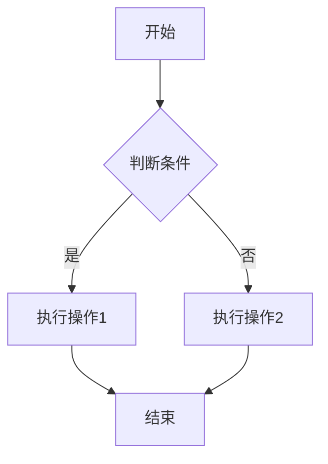

## 支持的图表类型

### 1. 流程图 (Flowchart)

流程图是最常用的图表类型，用于表示工作流程、决策过程等。

#### 基本流程图
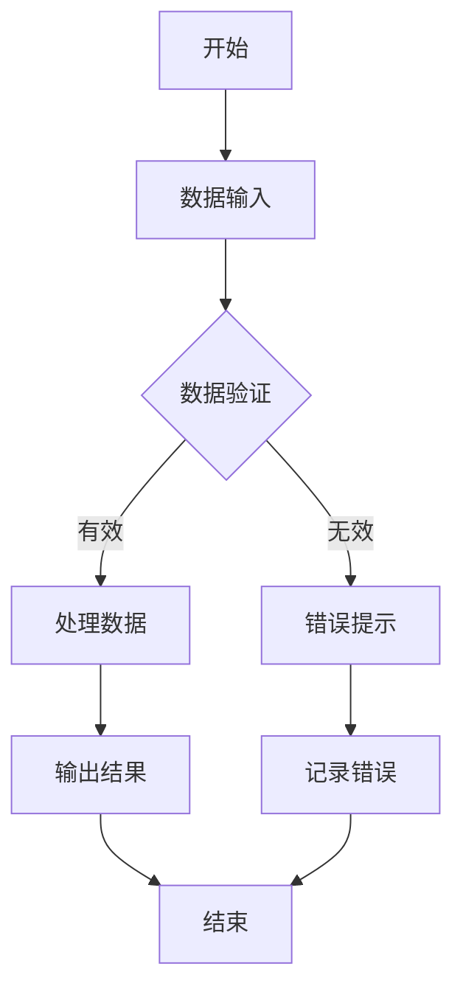

#### 子流程图
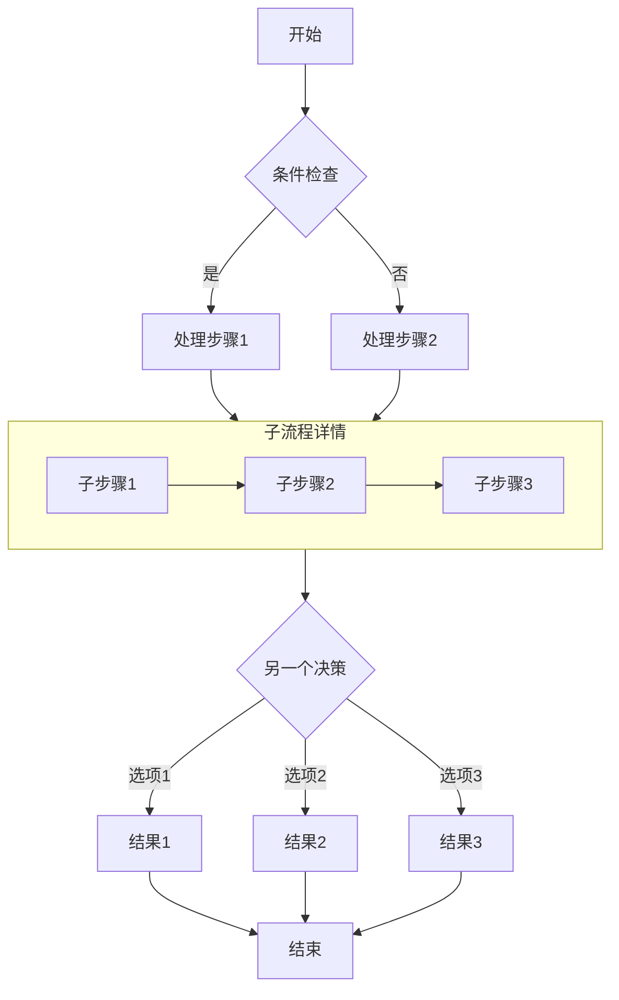

### 2. 序列图 (Sequence Diagram)

序列图用于展示对象之间的交互顺序。

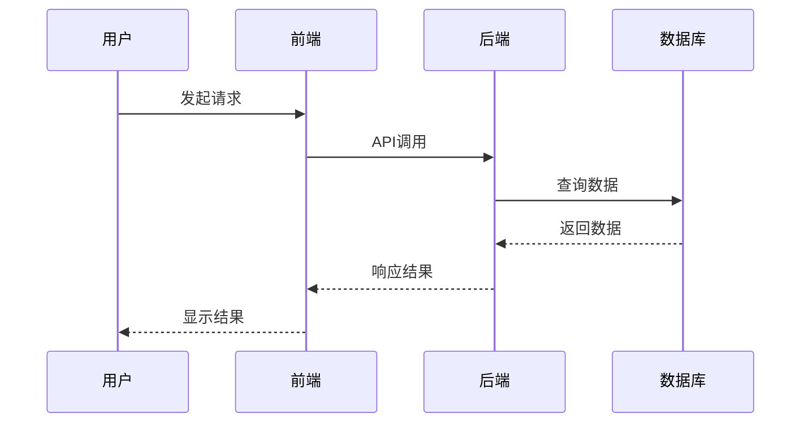

### 3. 类图 (Class Diagram)

类图用于展示类的结构和关系。

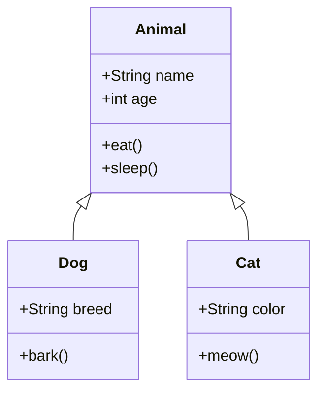

### 4. 状态图 (State Diagram)

状态图用于展示对象的不同状态和状态转换。

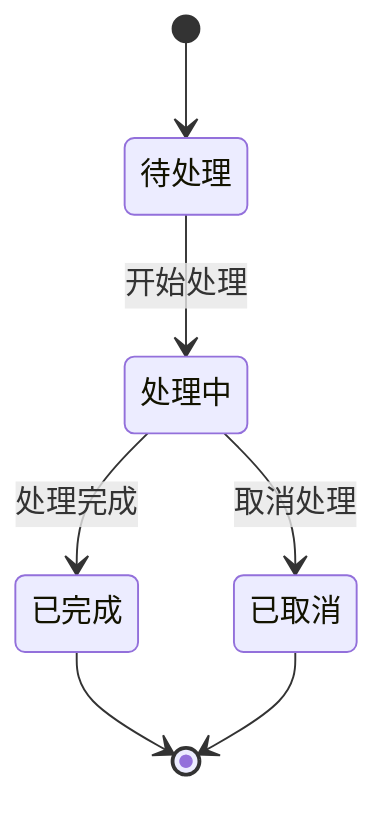

### 5. 饼图 (Pie Chart)

饼图用于展示数据的占比关系。

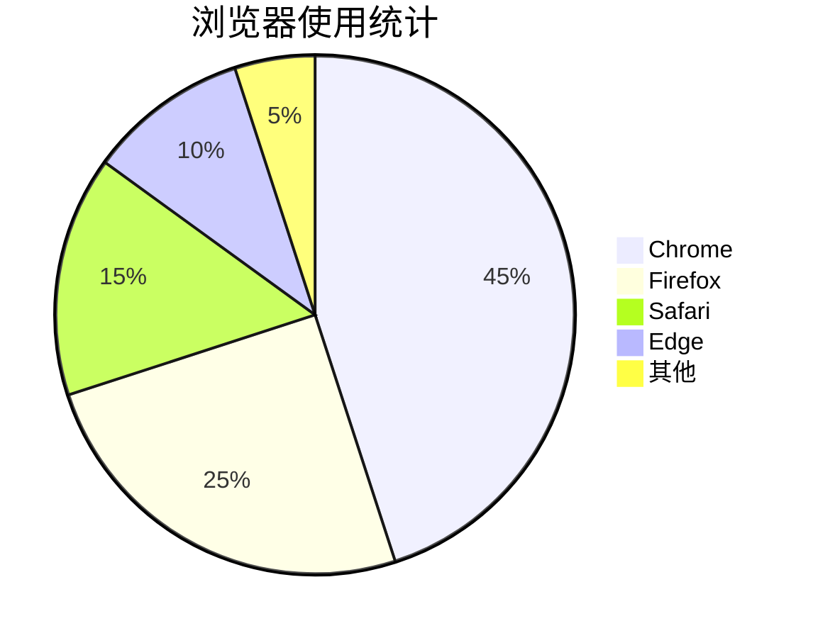

### 6. 甘特图 (Gantt Chart)

甘特图用于项目管理和时间规划。

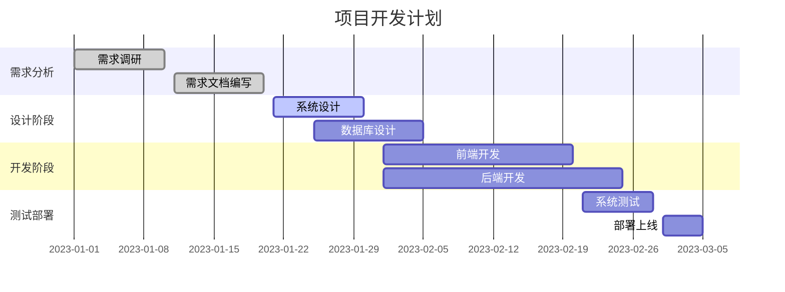

## 高级技巧

### 自定义样式

你可以为节点和连接线添加自定义样式：

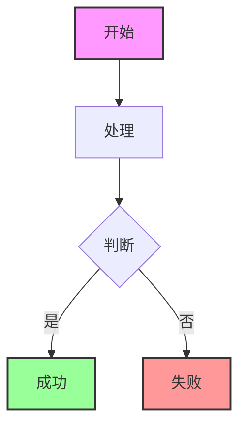

### 使用注释

在复杂的图表中添加注释可以提高可读性：

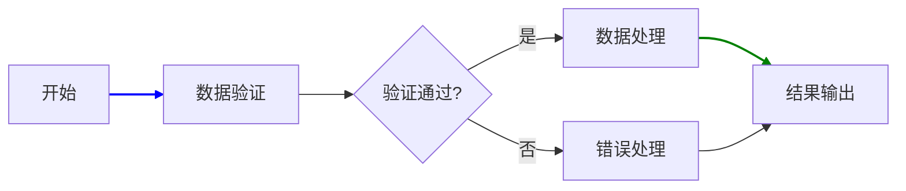

### 子图和分组

使用子图可以组织复杂的图表结构：

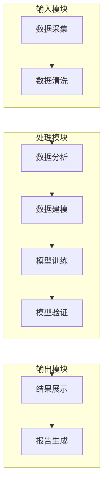

## 最佳实践

1. **保持简洁**：避免在单个图表中展示过多信息，可以拆分为多个相关图表
2. **使用清晰的方向**：TB（从上到下）和 LR（从左到右）是最常用的方向
3. **添加说明文字**：为重要的节点和连接添加说明
4. **保持一致性**：在整个文档中保持图表样式的一致性
5. **测试图表**：在预览中检查图表是否按预期显示

## 常见问题

### Q: 图表不显示怎么办？
A: 确保：
- 使用了正确的 ```mermaid 代码块语法
- 语法没有错误（可以通过 Mermaid 在线编辑器验证）

### Q: 如何调整图表大小？
A: 可以通过添加 CSS 来调整图表大小，或者在图表周围添加容器。

### Q: 图表中的中文显示不正常？
A: 确保网页编码设置为 UTF-8，并且 Mermaid 配置中设置了正确的字体。

## 参考资源

- [Mermaid 官方文档](https://mermaid-js.github.io/mermaid/)
- [Mermaid 在线编辑器](https://mermaid.live/)